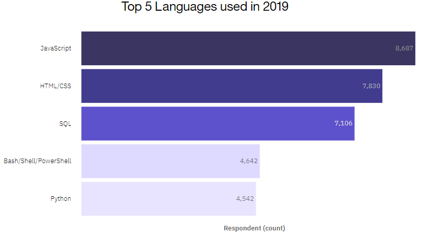
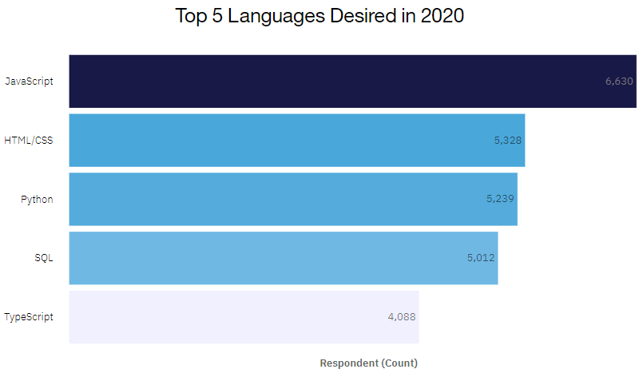
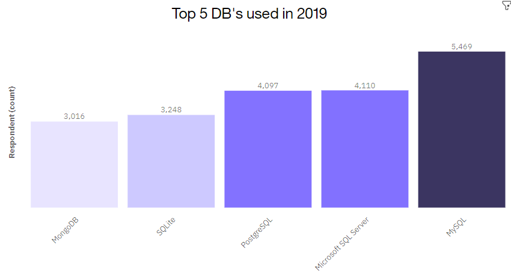
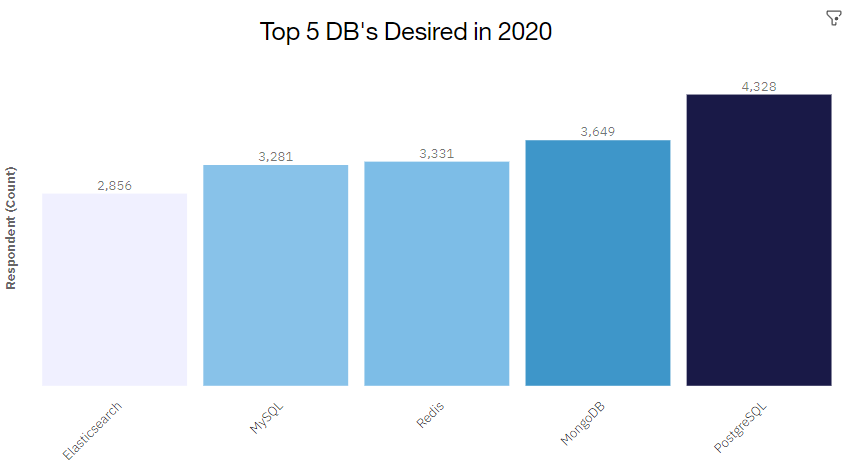
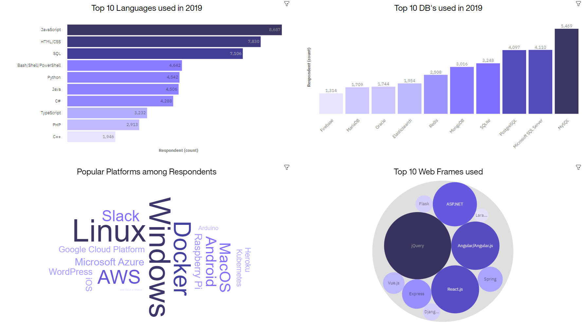
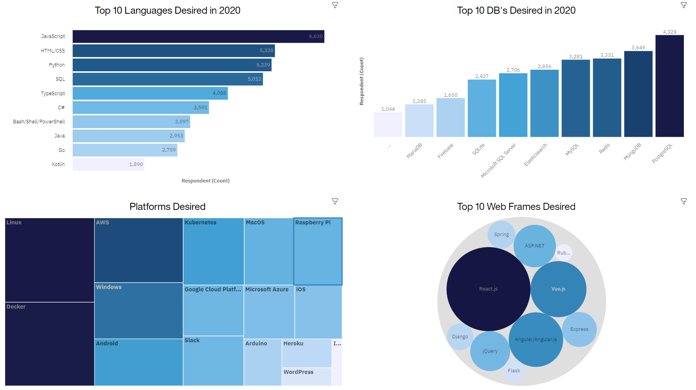
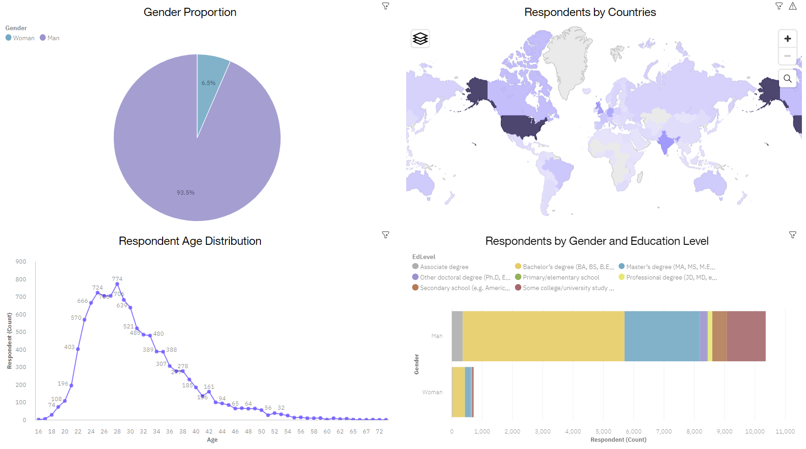

# Current and Future Data Tech Trends (IBM Capstone Project)

## Introduction

In response to the evolving technology landscape and the demand for specific skills in the job market, Stack Overflow, a well-known platform for developers, conducted a global online survey in 2019. The primary goal of the survey was to gain insights into the technologies currently utilized by software professionals and their intentions to acquire new skills in the upcoming year.

This project aims to perform an exploratory analysis on the survey data in order to address the following questions:

1. What were the top 5 programming languages and databases used by survey respondents in 2019, and which ones did they express a desire to learn in the following year?
2. What were the leading platforms and web frameworks utilized by respondents in 2019, and which ones were they planning to learn in 2020?

To answer these questions, statistical techniques will be applied to the data, which will be preprocessed using data wrangling techniques.

## Methodology
As mentioned in the introduction, Stack Overflow conducted an online survey of software professionals worldwide. The survey data was later open-sourced by Stack Overflow. The actual dataset comprises approximately 90,000 responses. However, for this project, a randomized subset containing around 1/10th of the original dataset was used.

The collected data is cleaned and preprocessed using Jupyter Notebook to prepare it for analysis. Subsequently, exploratory analysis techniques are employed to assess data distribution, detect outliers, and uncover correlations. Finally, all the information is brought together by developing a dashboard using IBM Cognos Analytics.

## Trends

### Programming Language Trends

  
  

### Database Trends

  
  

## Dashboards (IBM Cognos Analytics)

### Current Technology Dashboard

### Future Technology Dashboard

### Demographics Dashboard

## Conclusion

The primary objective of this analysis was to identify future skill requirements and address the following questions:

1. What are the top programming languages that are expected to gain popularity in 2020?
   - According to the dashboard, Python, TypeScript, GO, and Kotlin emerged as the four languages desired by a greater number of respondents in 2020 compared to those who used them in 2019.

2. Which databases are anticipated to be more sought after in 2020?
    - PostgreSQL, MongoDB, Redis, and Elasticsearch experienced a surge in the number of respondents expressing a desire to learn them in 2020 compared to those who used them in 2019.

3. What are the top platforms and web frameworks desired in 2020?
    - The top 5 platforms identified are Linux, Windows, Docker, AWS, and Android.
    - The top 5 web frameworks sought after are React.js, Angular.js, Vue.js, jQuery, and ASP.NET.
  
These findings provide valuable insights into the evolving preferences and aspirations of software professionals, highlighting the languages, databases, platforms, and web frameworks that are likely to be in high demand in the year 2020.
